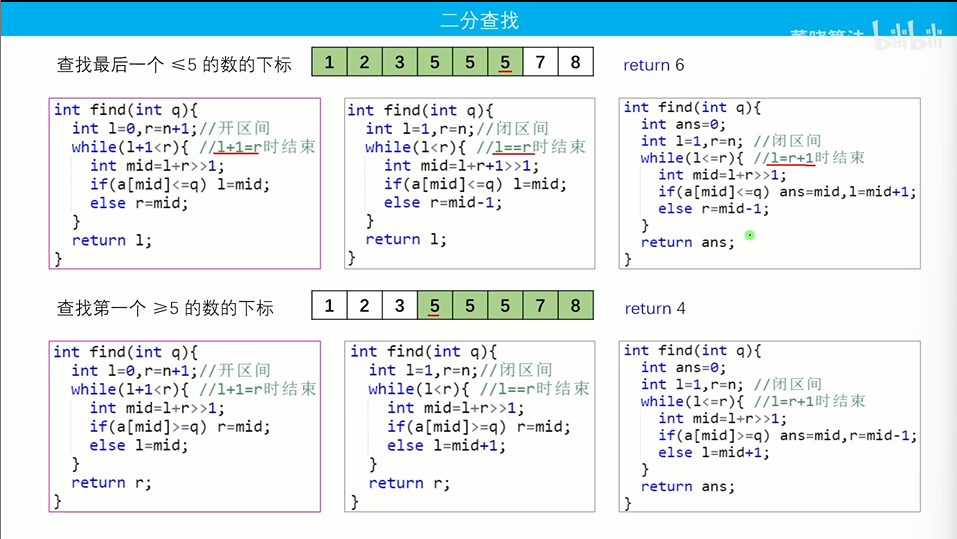
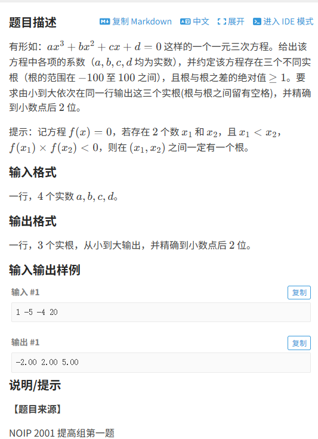
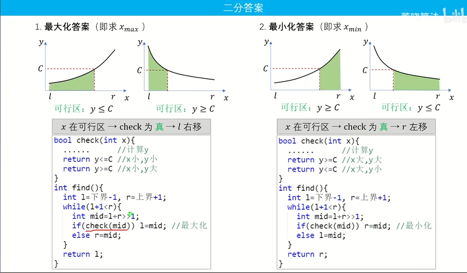

# 二分查找

## 算法思路

题目1：查找最后一个<=5的数（可行区：<=5）
题目2：查找最后一个>=5的数（可行区：>=5）
思路：
1.令<=5为可行区，让l 在可行区查找，r在>5的范围查找;也就是A[mid]<=5 l = mid/mid+1；
2.令>=5为可行区(A[mid]>=5)，让r在可行区查找，l在<5的范围查找；也就是A[mid]<=5 r = mid/mid-1；

核心问题是：1.找到可行区，满足条件可行区指针移动，不满足可行区外指针移动

三种二分模板：（ 默认数组从下标1存到下标n）

模板①：开区间（l = 0,r =n+1），l+1 == r 结束；
if（A[mid]>=c）l == mid; else r = mid;最后一次更新的l/r指向的就是答案；
1.指针的跳跃次数(**logn**)；
2.可行区指针最后指向答案；
3.开区间为了正确处理边界，r在满足l条件最后一个数l到不了最后一个数（即答案）；

模板②：闭区间（l = 1,r=n），l == r 结束；
		if（A[mid]>=c）l == mid; else r = mid-1;最后一次更新l/r指向的就是答案；
1.指针的跳跃次数(**logn**)；
2.可行区指针最后指向答案；
模板③：闭区间（l = 1,r=n），l ==  r+1 结束；
		if（A[mid]>=c）ans = mid,l == mid; else r = mid-1;mid指向答案

## 例题

### 例题1：luogu P2249查找

[P_2249_深基_13_例_1_查找](https://www.luogu.com.cn/problem/P2249#ide)
题解：

```cpp
#include<bits/stdc++.h>
using namespace std;

vector<int> A;
int main(){
    int n,m;
    cin>>n>>m;
    for(int i = 0;i<n;i++){
        int c;
        cin>>c;
        A.push_back(c);
    }
    for(int i = 0;i<m;i++){
        int c;
        int ans = 0;
        cin>>c;
        int l = 0,r = n-1;
        while(l<=r){
            int mid = l+(r-l)/2;
            if(A[mid]>=c){
                r = mid-1;ans = mid;
            }
            else l= mid+1;
        }
        if(A[ans] == c) cout<<ans+1<<' ';
        else cout<<-1<<' ';
    }
    return 0;
}
```

### 例题2：luogu P1024 一元三次方程

[P_1024_NOIP_2001_提高组_一元三次方程求解](https://www.luogu.com.cn/problem/P2249#ide)



题解：

```cpp
#include<bits/stdc++.h>
#define db double
using namespace std;
db a,b,c,d;
db fun(db x){
    return a*x*x*x+b*x*x+c*x+d;
}
db find(db l,db r){
    while(r-l>0.0001){
        db mid = (l+r)/2;
        if(fun(mid)*fun(r)<0)   l = mid;
        else    r = mid;
    }
    return l;
}
int main()
{
    cin>>a>>b>>c>>d;
    for(int i = -100;i<100;i++){
        double y1 = fun(i),y2 = fun(i+1);
        if(!y1){
            printf("%.2lf ",1.0*i);
        }
        if(y1*y2<0){
            printf("%.2lf ",find(i,i+1));
        }
    }
    return 0;
}
```

 二分函数返回值可写成	return (a[l]>=target) ? l : -1 ;

# 二分答案



题目求解设为x；通过题目过程模拟求出y；
y值有计数型，求和型，是否型；
二分板子由函数图像确定；

例题
