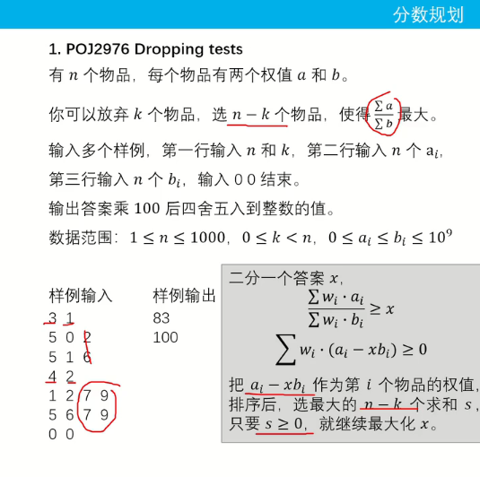

# POJ2976 Dropping tests



**输入处理** ：循环读入 n,k，直到 n=0,k=0 结束。

**二分初始化** ：左边界 left=0，右边界 right=1（因为 ai≤bi，所以 ∑bi/∑ai≤1）。

**二分迭代** ：

* 取中间值 mid=(left+right)/2
* 计算所有 ci=ai−mid⋅bi，并升序排序
* 取后n−k个ci求和s
* 若 s≥0，则 left=mid；否则 right=mid
* 重复迭代直到 right−left 足够小（如1e-8）

时间复杂度：O(nlogn*log(1e4)));

空间复杂度：O(n);

```cpp
#include<bits/stdc++.h>
using namespace std;
const int N = 1010;
double a[N],b[N],c[N];
int n,k;
bool check(double x){
    double s = 0;
    for(int i = 1;i<=n;++i) c[i] = a[i] - x*b[i];
    sort(c+1,c+n+1);
    for(int i = k+1;i<=n;i++)   s+=c[i];
    return s>=0;
}
double find(){
    double l = 0,r = 1;
    while(r-l>1e-4){
        double mid = (l+r)/2;
        if(check(mid))  l = mid;
        else r = mid;
    }
    return l;
}
int main(){
    while(cin>>n>>k,n){
        for(int i = 1;i<=n;i++) cin>>a[i];
        for(int i = 1;i<=n;i++) cin>>b[i];
        cout<<fixed<<setprecision(0)<<(find()*100)<<'\n';
    }
    return 0;
}
```
