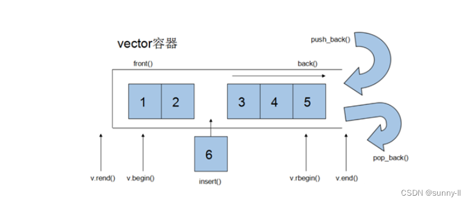

# 什么是vector？

**向量（vector）是一个封装了动态大小数组的顺序容器**（Sequence Container）跟任意其他类型容器一样，它能够存放各种类型的对象。可以简单的认为，**向量是一个能够存放任意类型的动态数组**。

## vector的基本概念

 **Vector**的数据安排以及操作方式，与**array(数组)**非常**相似**，两者的**唯一差别**在于**空间的运用的灵活性。**

* **Array是静态空间**，一旦配置了就不能改变，要换大一点或者小一点的空间，可以，一切琐碎得由自己来，首先配置一块新的空间，然后将旧空间的数据搬往新空间，再释放原来的空间。
* **Vector是动态空间**，随着元素的加入，它的内部机制会自动扩充空间以容纳新元素。因此vector的运用对于内存的合理利用与运用的灵活性有很大的帮助，我们再也不必害怕空间不足而一开始就要求一个大块头的array（数组）了。

  **Vector的实现技术，关键在于其对大小的控制以及重新配置时的数据移动效率**，一旦vector旧空间满了，如果客户每新增一个元素，vector内部只是扩充一个元素的空间，实为不智，因为所谓的扩充空间(不论多大)，一如刚所说，是”配置新空间-数据移动-释放旧空间”的大工程,时间成本很高，应该加入某种未雨绸缪的考虑，稍后我们便可以看到vector的空间配置策略。



## vector的作用是什么

**vector**是C++标准模板库中的部分内容，中文偶尔译作“容器”，但并不准确。**它是一个多功能的，能够操作多种数据结构和算法的模板类和函数库**。vector之所以被认为是一个容器，是因为它能够像容器一样存放各种类型的对象，简单地说，**vector是一个能够存放任意类型的动态数组，能够增加和压缩数据。**

## 总结

1.vector是表示**可变大小数组的序列容器。**

# vector的（一维）定义

1

# vector（一维）常用接口的使用

1

## vector的常见构造（初始化）

1

## vector的遍历及迭代器的操作

1

1

---

vector

**1.arr.push_back();**

在数组末尾添加一个元素长度加一

```
arr.push_back();
```

**2.arr.insert()**;

```
arr.insert(arr.begin() + 1, 1);  // 在索引1位置插入1 , arr[]:1 2 3 4 5-->1 1 2 3 4 5
```

```
arr.insert(arr.begin() + 2, 10);  // 在索引2位置插入10
```

问点1：vector一维数组可以用memset，多维不可以

1. **外层 `vector`** ：存储的是 **一个个 `vector<int>`容器对象** （每个对象包含指向自身数据的指针、`size`、`capacity`等成员），这些容器对象本身是连续存储的，但它们指向的内层数据内存是**分散独立**的。
2. **内层 `vector<int>`** ：每个内层 `vector`的底层是 **连续的 `int`数组** ，但不同行的数组在内存中可能不相邻。

如果直接对整个二维 `vector`调用 `memset`，会破坏外层 `vector`中容器对象的内部结构（比如修改 `size`、`capacity`成员），导致程序崩溃或行为异常。
解决办法：逐行用fill（**fill(vec.begin(), vec.end(), 0**）或者**memset(row.data(),0,row.size()*sizeof(int)1.);**
