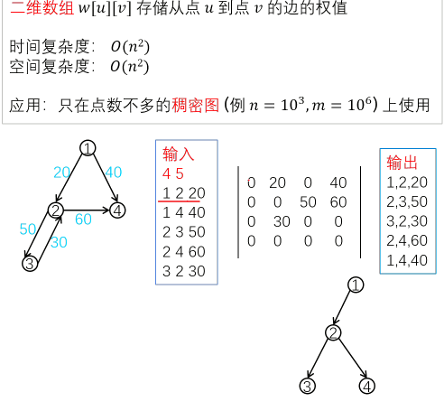
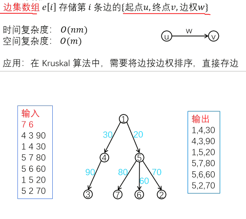
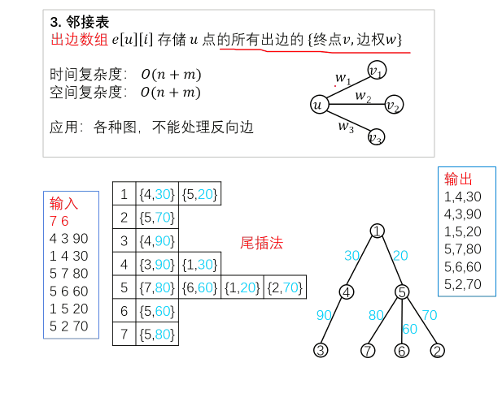

# 图的存储

## 1.邻接矩阵



**代码示例**

```
#include<isotream>
using namespace std;
int w[N][N];
int vis[N];
void dfs(int u){
    vis[u] = true;
    for(int v = 1;v<=n;v++){
        if(w[u][v]){
            printf("%d,%d,%d\n",u,v,w[u][v]);
            if(vis[v])    continue;
            dfs(v);
        }
    }
}
int main(){
    cin>>n>>m;
    for(int i = 1;i<=m;i++){
        cin>>a>>b>>c;
        w[a][b] = c;
        // w[b][a]=c;
    }
    dfs(1);
    return 0;
}
```

# 2.边集数组



**代码示例：**

```
#include<iostream>
using namespace std;
const int M = 10086;
const int N = 10086;
struct edge{
    int u,v,w;
}e[M];//边集
int n = 0,m = 0;
bool vis[N];
void dfs(int u){
    vis[u] = true;
    for(int i = 1;i<=m;i++){
        if(e[i].u==u){
            int v=e[i].v,w=e[i].w;
            printf("%d,%d,%d\n",u,v,w);
            if(vis[v])    continue;
            dfs(e[i].v);
        }
    }
}
int main(){
    int a,b,c;
    cin>>n>>m;
    for(int i = 1;i<=m;i++){
        cin>>a>>b>>c;
        e[i] = {a,b,c};
        //e[i] = {b,a,c}; //这里看起来好像有点不太对
    }
    dfs(1);
    return 0;
}
```

# 3.邻接表（重点）



```

```
