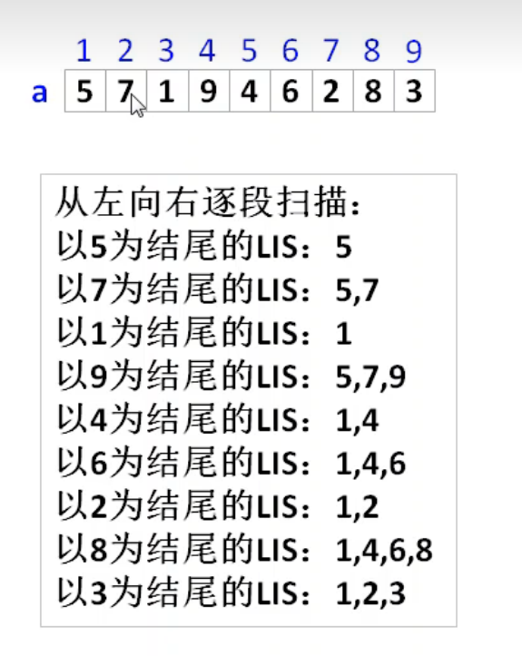

# B3637 最长上升子序列

[B3637 最长上升子序列](https://www.luogu.com.cn/problem/B3637)

## 题目描述

这是一个简单的动规板子题。

给出一个由 $n(n\le 5000)$ 个不超过 $10^6$ 的正整数组成的序列。请输出这个序列的**最长上升子序列**的长度。

最长上升子序列是指，从原序列中**按顺序**取出一些数字排在一起，这些数字是**逐渐增大**的。

## 输入格式

第一行，一个整数 $n$，表示序列长度。

第二行有 $n$ 个整数，表示这个序列。

## 输出格式

一个整数表示答案。

## 输入输出样例 #1

### 输入 #1

```
6
1 2 4 1 3 4
```

### 输出 #1

```
4
```

## 思路



从每个序列都能发现，例如 1,4,6,8在找到8时前面的1,4,6已经找到了， 再往前1,4也是找到过的，所以我们创建一个f数组，f[i]记录到第i个数组，最长上升序列为多长就好，现在加入到1 4，那到6的时候就是2+1,6的地方就是3，到8同理就是3+1，

由此产生了第一个状态更新方程就是if(a[i]>a[j]) f[i] = a[j]+1

&&f[j]+1>f[i]的诞生：因为如果时1 2 3 4 5 2 3 4 6序列，怕第二长的小序列 2 3 4在后面更新，没有f[i]+1>f[i]的限制，会让在6这个数字的f选择2 3 4 序列的f[j]+1;

## 代码

```
#include<iostream>
using namespace std;
int a[5009],f[5009];

int main(){
    int n;
    cin>>n;
    for(int i = 0;i<n;i++){
        cin>>a[i];
        f[i] = 1;
    }
    int ans = 1;
    int j = 0;
    for(int i = 0;i<n;i++){
        for(int j = 0;j<i;j++){
            if(a[i]>a[j]&&f[j]+1>f[i]){
                f[i] = f[j]+1;
            } 
        }
        ans = max(ans,f[i]);
    }
    cout<<ans;
    return 0;
} 
```

时间复杂度：O(N^2);
空间复杂度：O(N);

## 测试样例

1（常规样例）：1 2 4 1 3 4

output：4

2（卡f[j]+1>f[i]）: 1 2 3 4 5 2 3 4 6
output：6
